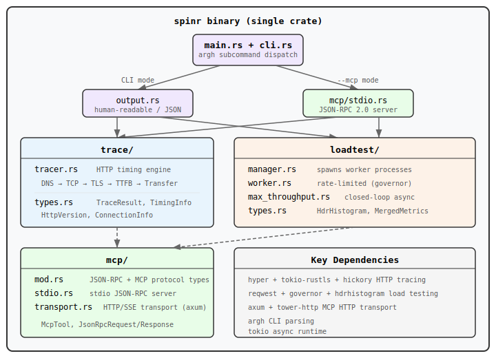

# spinr

HTTP performance & debugging tool. Trace requests with phase-by-phase timing or run wrk2-style load tests — from the CLI or as an MCP server for AI agents.

## Install

```sh
cargo install --path .
```

## Usage

### Trace

Detailed timing breakdown for HTTP requests (DNS, TCP, TLS, TTFB, transfer):

```sh
# Basic trace
spinr trace https://example.com

# POST with headers and body
spinr trace https://api.example.com/data -m POST -H "Authorization: Bearer token" -d '{"key":"value"}'

# HTTP/2, JSON output
spinr trace https://example.com --http-version 2 -j
```

### Load Test

Rate-limited load testing with HdrHistogram percentiles:

```sh
# 500 RPS for 30 seconds
spinr load-test https://api.example.com -R 500 -d 30

# Max throughput (closed-loop), 100 concurrent connections, 4 threads
spinr load-test https://api.example.com --max-throughput -c 100 -t 4 -d 10

# With warmup, JSON output
spinr load-test https://api.example.com -R 1000 -d 60 -w 5 -j
```

### MCP Server

Expose tools to AI agents via [Model Context Protocol](https://modelcontextprotocol.io):

```sh
# All tools (stdio transport)
spinr --mcp

# Trace tools only, HTTP transport
spinr trace --mcp -t http -p 3000

# Load test tools only
spinr load-test --mcp
```

**MCP tools exposed:**

| Tool | Description |
|---|---|
| `trace_request` | Trace HTTP request with timing breakdown |
| `start_load_test` | Start a rate-limited load test |
| `stop_load_test` | Stop a running load test |
| `get_status` | Get load test status and metrics |

## Docker

Four Dockerfiles for platform/profile combinations:

```sh
# Prod ARM64
docker build --provenance=false -t spinr:prod-arm64 -f prod.arm64.Dockerfile .

# Dev ARM64
docker build --provenance=false -t spinr:dev-arm64 -f dev.arm64.Dockerfile .

# Prod x86
docker build --provenance=false -t spinr:prod-x86 -f prod.x86.Dockerfile .

# Dev x86
docker build --provenance=false -t spinr:dev-x86 -f dev.x86.Dockerfile .
```

Images use `gcr.io/distroless/cc-debian13` as runtime base (~50-90MB total).

## Architecture



## Project Structure

```
src/
├── main.rs              # Entry point, subcommand dispatch
├── cli.rs               # argh argument definitions
├── output.rs            # Human-readable formatters
├── trace/
│   ├── tracer.rs        # HTTP timing (DNS, TCP, TLS, TTFB, transfer)
│   └── types.rs         # TraceResult, TimingInfo, etc.
├── loadtest/
│   ├── manager.rs       # Spawns/coordinates worker processes
│   ├── worker.rs        # Rate-limited request loop (blocking)
│   ├── max_throughput.rs # Closed-loop async benchmark
│   └── types.rs         # HdrHistogram, MergedMetrics, configs
└── mcp/
    ├── mod.rs           # JSON-RPC 2.0 + MCP protocol types
    ├── stdio.rs         # Stdio JSON-RPC server
    └── transport.rs     # Streamable HTTP transport with SSE
```

## License

MIT
